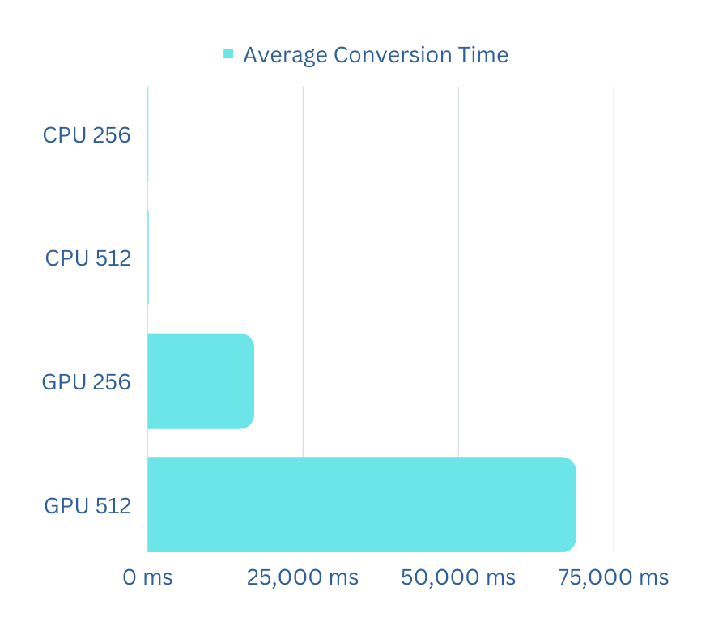

# Urbanek_104620_feippds assignment 05
## Converting RGB images to grayscale using CUDA with GPU and CPU - converting method

We have implemented solution for gray scaling images using **CUDA** and **numba JIT** compiler for
translating the code to understandable for **CPU** and **GPUs**. We will just explain the summed up implementation.
We have **R G B** image in format ***.jpg*** or ***.png***. We give name as input of image that we want to convert to grayscale.
We then convert the image to grid of blocks with specified size and each block. Then we convert the blocks with simply mathematically
multiplication with specified values by **R G B**.
###
Further, in documentation we have described more detailed and explained assignment, implementation, 
necessary variables for understanding the implementation, the code, how to get going the program, 
the calculations of the average times of conversions,
and we showed the program output.


### Solution - Implementation
Firstly we have imported all necessary data structures, libraries, compiler that we will be using later in the code.
```python
import numpy as np
import matplotlib.pyplot as plt
from numba import cuda, jit
from datetime import datetime
```

###
We have created obligatory function for converting the block of image to grayscale.
```python
def transform_to_gray_scale(pixels):
    """Transform pixels to grayscale picture
    Args:
        pixels -- input image as NumPy array
    """
    # GPU conversion
    if cuda.is_available():
        # Set up CUDA grid and block dimensions
        threads_per_block = (32, 32)
        blocks_per_grid_x = (pixels.shape[1] + threads_per_block[0] - 1) // threads_per_block[0]
        blocks_per_grid_y = (pixels.shape[0] + threads_per_block[1] - 1) // threads_per_block[1]
        blocks_per_grid = (blocks_per_grid_x, blocks_per_grid_y)

        # Allocate device memory for input and output images
        d_rgb_img = cuda.to_device(pixels)
        d_gray_img = cuda.device_array(shape=pixels.shape[:2], dtype=np.float32)

        # Launch the kernel function
        grayscale_gpu[blocks_per_grid, threads_per_block](d_rgb_img, d_gray_img)

        # Copy the output grayscale image back to the host
        gray_img = d_gray_img.copy_to_host()
    # CPU conversion
    else:
        gray_img = np.zeros((pixels.shape[0], pixels.shape[1]), dtype=np.float32)
        grayscale_cpu(pixels, gray_img)

    return gray_img
```
The function firstly checks that if cuda is available. If the **CUDA** is available then it set up the threads, blocks allocate memory
and launch the kernel on each thread in parallel
**@cuda.jit** which indicates that the function will be compiled with Numba **CUDA** enabled compiler and run it on **GPU**.
```python
@cuda.jit
def grayscale_gpu(img, gray):
    """Converting RGB image to grayscale. GPU method
    Args:
        img -- input image as NumPy array
        gray -- output grayscale image
    """
    
    x, y = cuda.grid(2)
    if x < img.shape[1] and y < img.shape[0]:
        b = img[y, x, 0]
        g = img[y, x, 1]
        r = img[y, x, 2]
        gray[y, x] = 0.299 * r + 0.587 * g + 0.114 * b
```
This kernel function have two arguments input image ***img*** and output gray scaled img ***gray***. The kernel function obtains
the **x,y** that indices to the **2D** thread blocks. Then there is a condition that checks if current thread is within the
bounds of the input image. If it is **true** it extracts the **R G B** colors and multiply it with constant values as standard formula
**0.299 * r + 0.587 * g + 0.114 * b**. 


If the **CUDA** is not available it runs the second kernel function. Which has prepared image with **np.zeros** with the same
dimensions of the entered image.


```python
@jit
def grayscale_cpu(img, gray):
    """Converting RGB image to grayscale. CPU method
    Args:
        img -- input image as NumPy array
        gray -- output grayscale image
    """
    for y in range(img.shape[0]):
        for x in range(img.shape[1]):
            b = img[y, x, 0]
            g = img[y, x, 1]
            r = img[y, x, 2]
            gray[y, x] = 0.299 * r + 0.587 * g + 0.114 * b

```
This kernel function does not have the superpower as it has the previous one. For better understanding look at tutorial https://www.youtube.com/watch?v=X00djifIj9s. 
It does not have the parallel processing superpower of the GPU to process multiple pixels simultaneously.
https://www.youtube.com/watch?v=Lg4WETxq7nc.

The kernel function is similar to previous but this iterates through every pixel where extracts **R G B**
and calculated them as shown before.

###
Last part is the main function where https://www.youtube.com/watch?v=x0yQg8kHVcI is being done.
```python
def main():
    """Run main."""
    while True:
        print("Is cuda available: " + str(cuda.is_available()))
        picture_name = input("Input picture name: ")
        try:
            method_prefix = "_cpu"
            if cuda.is_available():
                method_prefix = "_gpu"
            pixels = plt.imread(picture_name + ".jpg")
            start_time = datetime.now()
            new_pixels = transform_to_gray_scale(pixels)
            plt.imsave(picture_name + "_gray" + method_prefix + ".jpg", new_pixels, cmap="gray", format="jpg")

            print("\nFinished gray_scaling process!")
            end_time = datetime.now()
            timer = end_time - start_time
            print('Total time: {}'.format(timer)+"\n")
        except FileNotFoundError:
            print("Wrong picture name name! Try again\n")


if __name__ == "__main__":
    main()
```
There is a **while** infinite loop. We explained it at the beginning of the documentation. I know what you are thinking about. https://www.youtube.com/watch?v=r94vuvwUSkY .
I am talking about the **CUDA**. We print the **CUDA** availability. Then we are asking for input picture name without postfix
we then try to open the picture. Where we by default set up postfix to **_cpu** if is cuda available we change it to **_gpu**. We open the picture
and the set-up the timer for the conversion duration, and we call the transform function that performs the conversion. We save it with entered name and precise postfix.
We print total time of conversion. We defined the exception if user has given wrong image name or if it is not in the folder with the program, so it cannot be opened.

###
And at the end https://www.youtube.com/watch?v=DB79HuYbemw. We performed the test for the 5 different picture of size 256x256
for **GPU** and **CPU** conversion. We calculated the average conversion time, and we evaluate it on graph. 
Consider that this was just a small test for better understanding and for bigger images
where **CPU** time complexity of **O(N)** will perform worse you can test it your self. 


### Calculation

### CPU - conversion
#### 256
* avatarJokay256 - 0:00:00.004037
* batman256 - 0:00:00.005243
* lickingJokay256 - 0:00:00.004632
* nina1_256 - 0:00:00.003444
* puertorico256 - 0:00:00.005999

#### 512
* avatarJokay512 - 0:00:00.406029
* batman512 - 0:00:00.014032
* lickingJokay512 - 0:00:00.195330
* nina1_512 - 0:00:00.009403
* puertorico512 - 0:00:00.009613


### GPU - conversion
#### 256
* avatarJokay256 -0:00:16.265222
* batman256 - 0:00:17.006740
* lickingJokay256 - 0:00:17.517886
* nina1_256 - 0:00:16.611761
* puertorico256 - 0:00:18.099058

#### 512
* avatarJokay512 - 0:01:04.844765
* batman512 - 0:01:11.668252
* lickingJokay512 - 0:01:12.806412
* nina1_512 - 0:01:06.133457
* puertorico512 - 0:01:08.941407

As we can see from the outputs the average time for:
* **CPU** is:
  * **256x256** -> 0.0046712**s** ≈ 4.6**ms**
  * **512x512** -> 0.1268814**s** ≈ 126.9**ms**
  
* **GPU** is:
  * **256x256** -> 17.1001334**s** ≈ 17,100.1**ms**
  * **512x512** -> 68.8788586**s** ≈ 68,878.9**ms**



### Conversion output


### Setup
Before starting to implement similar solution or if you want to test it your self you need to install the **numba** compiler from one of these suggestions:
    
*  Throughout the **extension/packages** option in your developing environment
*  Using ```pip/conda install numba```

If your GPU does not support CUDA you can use emulator. To set it up you need to put this enablement in environment variables of your project
```NUMBA ENABLE CUDASIM=1``` or using Linux you can ```export NUMBA ENABLE CUDASIM=1``` or on Windows terminal ```set NUMBA ENABLE CUDASIM=1```.
When you want to disable it just set it to 0 ```NUMBA ENABLE CUDASIM=0```.

Recourses:
* the pdf file that we got from teachers
* https://chat.openai.com/
* https://github.com/mhezarei/CUDA-RGB-grey/blob/master/main_parallel.cpp
* https://www.kaggle.com/code/harshwalia/1-introduction-to-cuda-python-with-numba
* https://www.vincent-lunot.com/post/an-introduction-to-cuda-in-python-part-3/
* https://www.youtube.com/watch?v=sltSyddAGNs
* https://stackoverflow.com/questions/14711668/colored-image-to-greyscale-image-using-cuda-parallel-processing