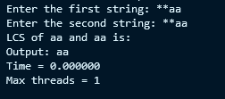
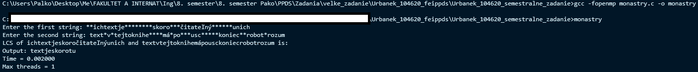
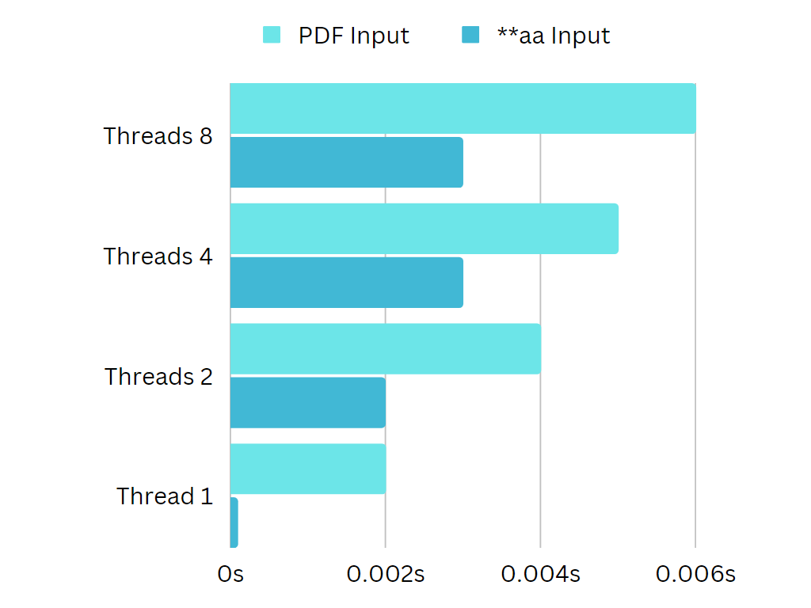

# Urbanek_104620_feippds semester assignment 06
## Monastry problem. Finding LCS(Longest common subsequence) based on input

We have implemented program that is desiphering the text from old resournces of monastry.
We have symbols '*' that are damaged. The code removes these dagaged symbols and try to find
the longest common text from two sources. Just for understanding simple example.

If we have **sourceA** = **aa ; **sourceB** = **aa longest common text is = **aa**.

###
Further, in documentation we have described more detailed and explained assignment, implementation, 
necessary variables for understanding the implementation, the code, how to get going the program, 
the calculations, and we showed the program output.

### Solution - Implementation
Firstly we have imported all necessary data structures, libraries, compiler that we will be using later in the code.
```C
#include <stdio.h>
#include <stdlib.h>
#include <string.h>
#include <omp.h>
```


###
We have defined global statements.
```C
#define MAX_LENGTH 10000
#define MAX(a,b) ((a)>(b)?(a):(b))
```

###
We have created obligatory function for 
removing start from the string input.
```C
void remove_stars(char* string) {
    /*Removing stars from given string
    Args:
        char* string -- entered string
    */
    int i, j;
    int len = strlen(string);

    //Iterate through string and rewrites it without stars
    for (i = 0, j = 0; i < len; i++) {
        if (string[i] != '*') {
            string[j++] = string[i];
        }
    }
    string[j] = '\0';
}
```

Function take a char pointer as a argument and then iterate 
through the **string** and if it is not * - star, it writes it to the **string**.

###
We have created LCS function. For finding longest common subsequence between the input strings.

```C
void lcs(char* sourceA, char* sourceB, int m, int n) {
    /*Removing stars from given string
    Args:
        char* sourceA -- entered first string input
        char* sourceB -- entered second string input
        int m -- length of soruceA
        int n -- length of sourceB
    */
    int* dp = (int*)calloc((m + 1) * (n + 1), sizeof(int));
    int i, j;

    // Calculate dp matrix using wavefront parallelism
    for (int sum = 0; sum <= m + n; sum++) {
        #pragma omp parallel for
        for (i = 0; i <= m; i++) {
            j = sum - i;
            if (j >= 0 && j <= n) {
                if (i == 0 || j == 0) {
                    dp[i * (n + 1) + j] = 0;
                }
                else if (sourceA[i - 1] == sourceB[j - 1]) {
                    dp[i * (n + 1) + j] = dp[(i - 1) * (n + 1) + (j - 1)] + 1;
                }
                else {
                    dp[i * (n + 1) + j] = MAX(dp[(i - 1) * (n + 1) + j], dp[i * (n + 1) + (j - 1)]);
                }
            }
        }
    }

    // Construct the longest common subsequence
    int index = dp[m * (n + 1) + n];
    char* lcs = (char*)malloc((index + 1) * sizeof(char));
    lcs[index] = '\0'; // Set the terminating character

    i = m, j = n;
    while (i > 0 && j > 0) {
        if (sourceA[i - 1] == sourceB[j - 1]) {
            lcs[--index] = sourceA[i - 1];
            i--; j--;
        }
        else if (dp[(i - 1) * (n + 1) + j] > dp[i * (n + 1) + (j - 1)]) {
            i--;
        }
        else {
            j--;
        }
    }

    printf("Output: %s\n", lcs);

    free(lcs);
    free(dp);
}
```

Function takes two input string as arguments also as their lenght. 
Firstly it initialized dp and then iterate through it and calculates dp
matrix using wavefront pattern, which computes diagonals concurrently.
Then it constructs **LSC** iterating again through **dp** and at the end
just prints out the output and free the **dp** and **LCS**.

###
At the end we have the main brain of our program the main!
```C
int main() {
    omp_set_num_threads(1);
    double start, end;
    
    char str1[MAX_LENGTH], str2[MAX_LENGTH];
    printf("Enter the first string: ");
    scanf("%s", str1);
    printf("Enter the second string: ");
    scanf("%s", str2);

    remove_stars(str1);
    remove_stars(str2);

    int m = strlen(str1);
    int n = strlen(str2);

    printf("LCS of %s and %s is: \n", str1, str2);
    start = omp_get_wtime();
    lcs(str1, str2, m, n);
    end = omp_get_wtime();

    printf("Time = %.6f\n", end - start);

    printf("Max threads = %d\n", omp_get_max_threads());
    return 0;
}
```

In the function we can set the num of threads we want to run our program on using 
``` omp_set_num_threads(x); ``` where x can be any number but it must be in range of our
threads on our computer machine. To see wmax available threads that can run our program we can use
``` printf("Max threads = %d\n", omp_get_max_threads()); ```, which will show us the max potential threads.
Then we defined our input string size with our ``` #define MAX_LENGTH 10000 ```. Then we use ``` scanf(); ``` to load
up the strings. We remove the stars from the string just to be easier to work with them.
We calculate the length of the string and then we measure time for our **lcs** finding.
At the end output found string with time spent on finding string is print out.

### Calculation
#### First Input
For the first input we used simple example for understanding the process.

**sourceA** = **aa


**sourceB** = **aa

***output*** = aa


Time output by threads:

***8*** Threads **-->** **0.003s**

***4*** Threads **-->** **0.003s**

***2*** Threads **-->** **0.002s**

***1*** Threads **-->** **0.0000s**

***Average time:*** ***0.0010625***

#### Output
1 Threads



#### Second Input
For second input we used the example from pdf that we get from proffesors.


**sourceA** = **ichtextje********skoro***èitate¾ný******unich


**sourceB** = text*v*tejtoknihe****má*po***usc*****koniec**robot*rozum

***output*** = textjeskorotu


Time output by threads:

***8*** Threads **-->** **0.006s**

***4*** Threads **-->** **0.005s**

***2*** Threads **-->** **0.004s**

***1*** Threads **-->** **0.001s**

***Average time:*** ***0.00425***

#### Output
1 Threads


#### Calculation - graph

### Setup

Before starting to implement similar solution or if you want to test it 
your self you need to install the **openMP** from one of these suggestions:

* https://www.open-mpi.org/software/ompi/v4.1/
* https://edu.itp.phys.ethz.ch/hs12/programming_techniques/openmpi.pdf

or using console ``` sudo apt install libomp-dev ```.
Also you will need gcc for compiling so we suggested this resource:
* https://dev.to/gamegods3/how-to-install-gcc-in-windows-10-the-easier-way-422j

After you install all neccessary libraries. Caution! You will need to enable the openMP before compiling. You can make your first openMP project. We suggest to use
***Visual Studio***, but it is all to your preferences. You make ***empty project*** and **.c** or **c++** file.
You write a code and then you use ``` gcc -fopenmp your_file.c -o your_file ``` to compile. After that you can just to
call your_file which is a **.exe** file in your **cmd**.
To enable openMP in ***Visual Studio*** --> ***right-click*** your your build project -> Properties -> C/C++ -> Language -> ***click*** Open MP support and choose yes or type
**Yes(/openmp)**.

***Recourses:***
* https://www.appsloveworld.com/c/100/646/longest-common-subsequence-with-openmp
* https://stackoverflow.com/questions/21052610/longest-common-subsequence-with-openmp
* https://www.semanticscholar.org/paper/%E2%80%9CAN-OPTIMIZED-PARALLEL-ALGORITHM-FOR-LONGEST-COMMON-Palaskar-Diwan/1c0c015cb537e898a8e32833e7f20f9ae73f7f86
* https://www.worldscientific.com/doi/10.1142/S0129626421500079
* https://github.com/mikearagao/longest-common-subsequence/blob/master/omp/lcs-omp.c
* https://www.youtube.com/watch?v=sSno9rV8Rhg
* https://chat.openai.com/